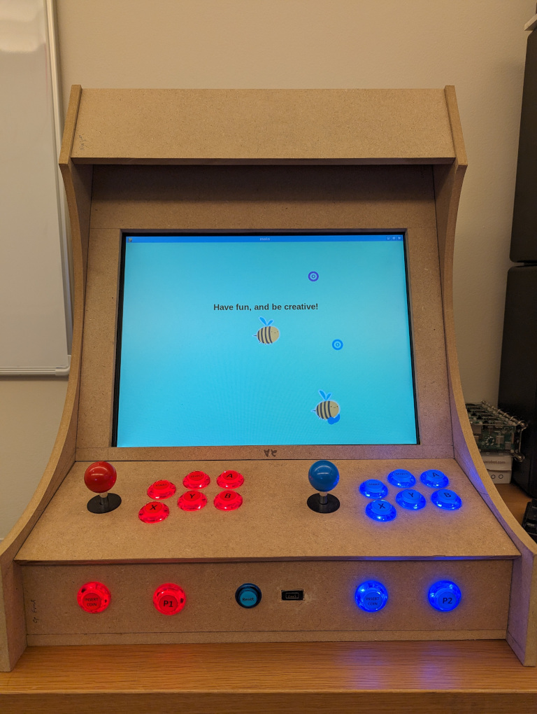

# The Arcade Box



This repository contains some simple demo code to show you how to make use of the arcade box at Carnegie Mellon University in Qatar.  At present, the arcade box only supports the `cmu_graphics` library.  Other libraries are not supported at this time.  (But they likely could be supported in the future.)

This documentation is a work in progress.

--Ryan Riley (rileyrd@cmu.edu)

## Porting Your Game

As a first step, I recommend that you make your initial designs using keyboard input.  The reason for this is simple:  The arcade box is a fun way to play a game, but it isn't a great way to test/debug.  You'll want to be able to do that on your local machine.  After you have a basic game working (such as MVP), then make arcade box support one of your post-MVP features.

Once you are ready to add arcade box support to your game, simply copy [`joystick.py`](https://github.com/CMU15-112/arcade-box-startercode/blob/main/joystick.py) from this repository into your project, and `import joystick` at the top of your file.  Look into ([`main.py`](https://github.com/CMU15-112/arcade-box-startercode/blob/main/main.py)) in this repository to see how it works.

In short, there are new callback functions that get called automatically when buttons are pressed.  You can distinguish which joystick and which button on that joystick was pressed.  (So, a 2-player game is possible.)

**Before testing on the actual arcade box, it is very important that you have a way to quit the game.**  The easiest way to do that is by making sure your `onJoyPress` function starts out as follows:

```python
def onJoyPress(app, button, joystick):
    if button == '5':
        sys.exit(-1)
```

This will cause your game to quit if someone presses the P1 button on the arcade box.

## Getting Your Code onto the Arcade Box

So, you have your fancy game, you've added some basic joystick support (and a quit key!) and you want to run it on the arcade box.  How do we make that happen?

### Use Git

Right now, the only supported method of loading your code onto the box is via git.  You need a git repository somewhere (most likely [GitHub](https://www.github.com/)).  You will send me a link to your repository and I'll add it to the arcade box.  Your repository can be public or private.  If it is private, I'll show you how to add a deployment key on GitHub so that the box can fetch your code.

### What Happens When You Run Your Game

When you select your game from the menu, the following happens:

1. The latest copy of your repository is pulled.  (So any changes you've pushed can be tested immediately.)
2. Any Python libraries listed in `requirements.txt` are downloaded and installed
3. The file `main.py` is run.

## Random Things

Things that I don't want to forget, but need to be better organized later.

- There is a reset button on the front of the box that does a hard reset of the machine.  Please use this sparingly, as frequent hard resets increase the chances of filesystem corruption.
- The joystick library ([`joystick.py`](https://github.com/CMU15-112/arcade-box-startercode/blob/main/joystick.py)) supports more than just the arcade box.  It also works with various gamepads.  For example, I've tested it with both PS4 and Nintendo Switch controllers connected to a PC via USB or Bluetooth.
- The arcade box supports a native resolution of 800x600.  You should use this resolution for your game.  (`runApp(width=800, height=600)`)
- I've never tested sound.  Maybe it works?
- The `cmu_graphics` library is not very efficient, and the CPU inside of the arcade box is not super high powered.  You'll need to be careful not to have too much complication in `redrawAll`.
